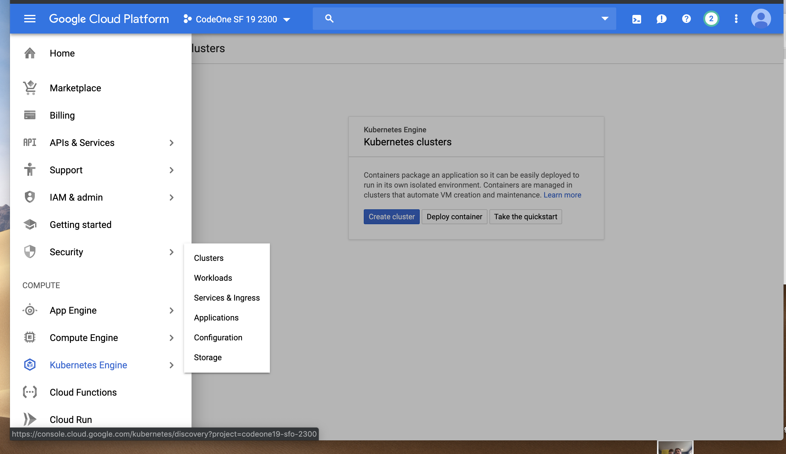

## Exercise 1 - Startup a Kubernetes Cluster using the Google Kubernetes Engine

### Enable Google Cloud APIs and set Default Zone and Region

You should perform all of the lab instructions directly in Cloud Shell.

1. Enable Google Cloud APIs that you'll be using from our Kubernetes cluster.

```sh
  gcloud services enable \
    cloudapis.googleapis.com \
    container.googleapis.com \
    containerregistry.googleapis.com
```

2. Set the default zone and region

```sh
  gcloud config set compute/zone us-central1-f
  gcloud config set compute/region us-central1
```

Note: For the lab, use the region/zone recommended by the instructor. Learn more about different zones and regions in [Regions & Zones documentation](https://cloud.google.com/compute/docs/zones).

### Create a Kubernetes Cluster using the Google Kubernetes Engine

1 - Creating a Kubernetes cluster in Google Cloud Platform is very easy! Use Kubernetes Engine to create a cluster:

```sh
  gcloud beta container clusters create guestbook \
    --addons=HorizontalPodAutoscaling,HttpLoadBalancing \
    --machine-type=n1-standard-4 \
    --cluster-version=1.12 \
    --enable-stackdriver-kubernetes --enable-ip-alias \
    --enable-autoscaling --min-nodes=3 --max-nodes=5 \
    --enable-autorepair \
    --scopes cloud-platform
```

**Note:** You can specify Istio as one of the addons when you create the cluster. Howerver for this workshop we will manually install Istio.

**Note:** The scopes parameter is important for this lab. Scopes determine what Google Cloud Platform resources these newly created instances can access.  By default, instances are able to read from Google Cloud Storage, write metrics to Google Cloud Monitoring, etc. For our lab, we add the cloud-platform scope to give us more privileges, such as writing to Cloud Storage as well.

This will take a few minutes to run. Behind the scenes, it will create Google Compute Engine instances, and configure each instance as a Kubernetes node. These instances don’t include the Kubernetes Master node. In Google Kubernetes Engine, the Kubernetes Master node is managed service so that you don’t have to worry about it!

You can see the newly created instances in the Compute Engine → VM Instances page.

2 - Grant cluster administrator (admin) permissions to the current user. To create the necessary RBAC rules for Istio, the current user requires admin permissions.

```sh
  kubectl create clusterrolebinding cluster-admin-binding \
    --clusterrole=cluster-admin \
    --user=$(gcloud config get-value core/account)
```

Admin permissions are required to instal Istio

3 - Verify kubectl

```sh
  kubectl version
```

4 - Install Helm

Helm is a Package Manager for Kubernetes, similar to Linux Packager Managers like RPM. We will use Helm to install Istio.

Install helm using the install script in the workshop script directory:

```sh
  cd istio-workshop/
  sh scripts/add_helm.sh
```

This script is from Jonathan Campos blog on [Installing Helm in Google Kubernetes Engine (GKE)](https://medium.com/google-cloud/installing-helm-in-google-kubernetes-engine-7f07f43c536e)

5 - Optional View the Kubernets Cluster in the Web Console

You can view the Kubernets Cluster in the Web Console by clicking on the hamburger icon and then going under Kubernetes Engine:




## Explanation
#### By Ray Tsang [@saturnism](https://twitter.com/saturnism)

This will take a few minutes to run. Behind the scenes, it will create Google Compute Engine instances, and configure each instance as a Kubernetes node. These instances don’t include the Kubernetes Master node. In Google Kubernetes Engine, the Kubernetes Master node is managed service so that you don’t have to worry about it!

#### [Continue to Exercise 2 - Deploying a microservice to Kubernetes](../exercise-2/README.md)
